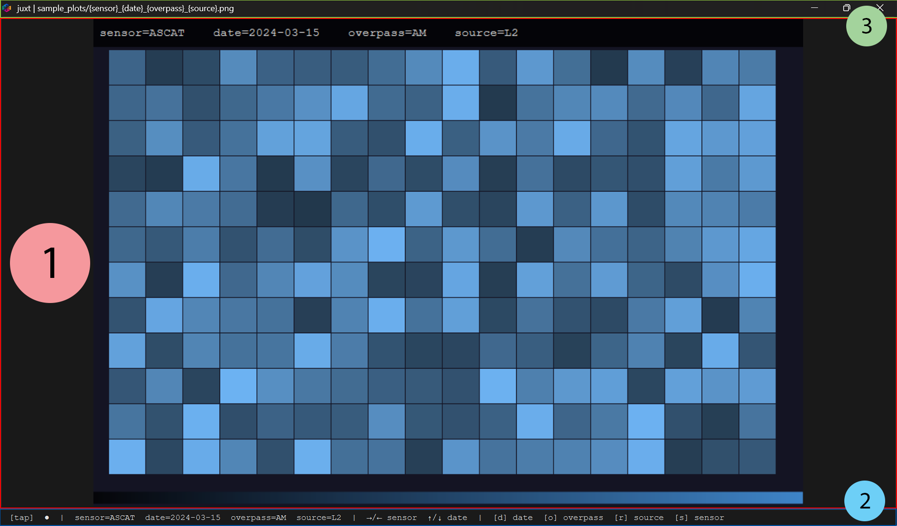
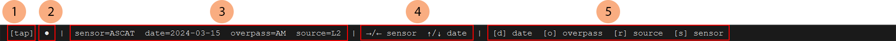
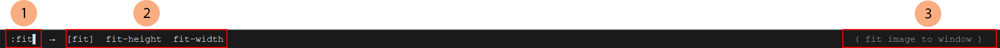
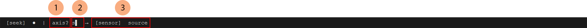
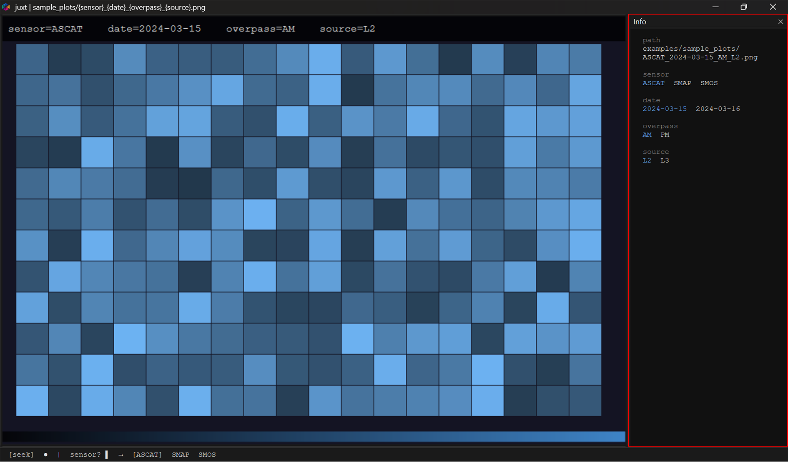
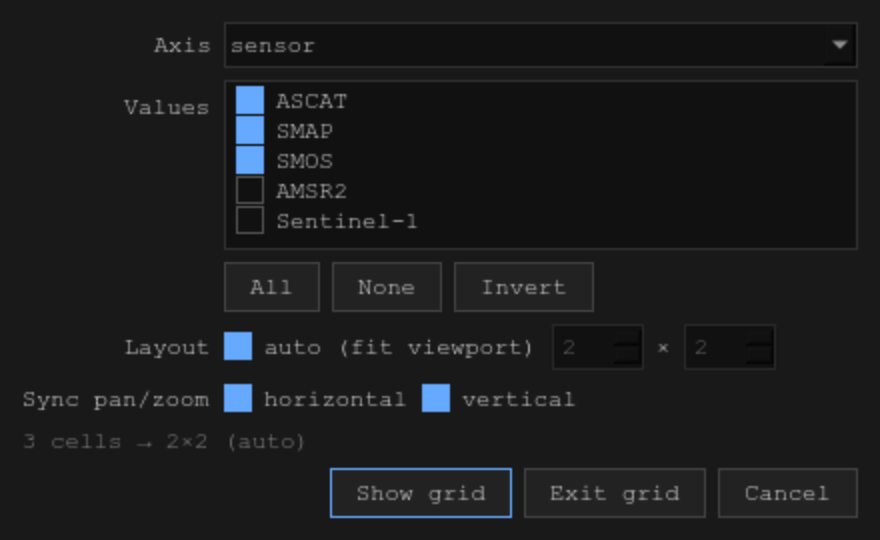

# UI overview

A quick tour of the juxt interface and its interactive elements.

---

## Main window

| # | Element | Description |
|---|---|---|
| 1 | **Image viewport** | Displays the current image. Drag to pan, scroll to zoom, double-click to fit. |
| 2 | **Status bar** | One-line summary of navigation state. Toggleable with `Ctrl+Shift+H`; auto-appears while command or value-picker is active. |
| 3 | **Title bar** | Shows `juxt \| <session name>`. The session name defaults to the config filename and can be overridden with `--name`. |

---

## Status bar

### Normal

| # | Element | Description |
|---|---|---|
| 1 | **Mode** | `[tap]`, `[seek]`, or `[pin]` — the active navigation mode. |
| 2 | **Watch indicator** | `●` when live file-watching is active; absent otherwise. |
| 3 | **Axis values** | Current position in the hypercube, e.g. `sensor=ASCAT  date=2024-03-16`. |
| 4 | **Arrow bindings** | Which axes are mapped to `←/→` and `↑/↓`, updated as you focus different axes. |
| 5 | **Letter assignments** | Which letter key navigates which axis. Axes without an available letter are shown in red. |

### Command mode

Triggered by pressing `:`.

| # | Element | Description |
|---|---|---|
| 1 | **Cursor** | The command being typed, e.g. `:fit▌`. In a free-text argument (`:pattern`, `:write`), each `{placeholder}` is coloured by position. |
| 2 | **Suggested values** | Prefix-matched command candidates; the selected entry is shown in `[brackets]`. After `Tab` on a path argument, this row lists the matching directory entries instead. |
| 3 | **Tooltip** | One-line description of the selected command, right-aligned. |

### Seek mode

Triggered by pressing any letter in seek mode. The same incremental search runs for both axis selection and value selection.

| # | Element | Description |
|---|---|---|
| 1 | **Prompt** | `axis?` while selecting an axis; `<axis-name> ›` while selecting a value on that axis. |
| 2 | **Cursor** | The query being typed. |
| 3 | **Candidates** | Matching axes or values; the current selection is shown in `[brackets]`. Automatically confirmed when only one candidate remains (configurable via `seek.greedy` in `~/.juxt/settings.yaml`). |

---

## Info sidebar

Toggle with `Ctrl+Shift+I` or `:info`. The panel docks to the right of the viewport and lists all axes with their values; the active value on each axis is highlighted.

---

## Grid builder

Open with `Ctrl+Shift+G` or `:grid-dialog` — a point-and-click front end for the
`:grid` command family.

| Field | Description |
|---|---|
| **Axis** | The axis to tile across the grid. Pre-selected to the current grid axis, or the `←`/`→` axis when not yet in grid view. |
| **Values** | One checkbox per value; only the ticked ones become cells. `All`, `None` and `Invert` set them in bulk. |
| **Layout** | With `auto` ticked the spin boxes preview the layout fitted to the viewport aspect ratio. Stepping either spin box unticks `auto` and hands you rows × cols; re-tick it to return to the fitted layout. Rows × cols is a hard cap — pick fewer panes than values and the leftovers stay reachable through the focused pane. |
| **Sync pan/zoom** | The per-axis equivalents of `:grid-sharex` and `:grid-sharey`. |

The grey line above the buttons previews the outcome — `3 cells → 2×2 (auto)` —
and says how many values the focused pane will cycle when an explicit layout has
fewer panes than selected values.

Click a pane to focus it; the grid axis then scrolls that pane alone, through
the values no other pane is showing.
**Show grid** applies the settings, **Exit grid** (shown only while a grid is
open) is the same as `:ungrid`, and every field is pre-filled from the active
grid, so the dialogue doubles as an editor for the current view.
